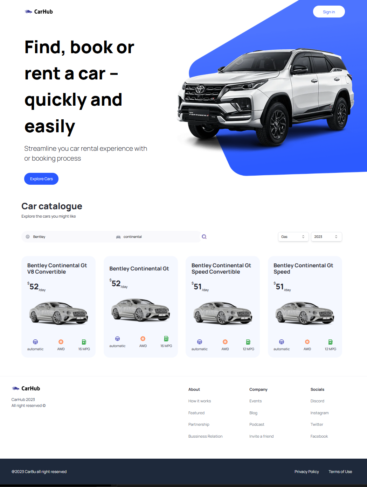

# NextJS - Car catalogue

# 🔗 [Live Preview](https://next-js-car-catalogue.vercel.app/)

---
## About 👋

This was a huge project with much logic and also my first time working with TypeScript. The main point of the project is the ability to filter cars (that are fetched using API) according to different filters and display info of selected car in a modal

THis was a code along practice of this project (https://youtu.be/pUNSHPyVryU?si=Wk3imKQDByLYuFOB).

There is a system bug with Next.js currently so that when user selects and confirms the filter the page will jump to top. This is due to useParams bug, every time params is updated, page will jump to top.

---

## Features 👨‍💻

* User can input information into a field and get filtered results corresponding to the input information.

* There are 4 input fields. User can filter cars by:
    - Brand (Ford, Bentley, Kia, Audi...)
    - Model (Continental, Q4...)
    - What kind of fuel it uses (Gas, Electricity...)
    - Year (2020, 2021, 2023...)

* Upon clicking on "View More" button inside the car card, a modal will open that will display properties of that selected car, and images from different angles

* Hero and Footer sections are non interactable as they are not the main focus of this project

---

## Languages

* Next.js: components, fetching data, maps, conditionals, router
* TypeScript: TS props
* Tailwing: for styling

